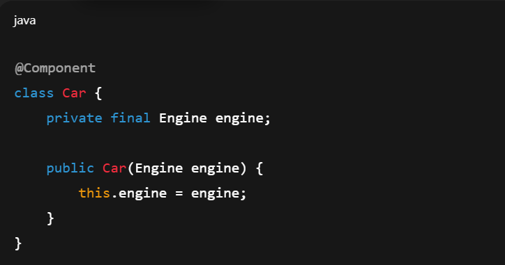
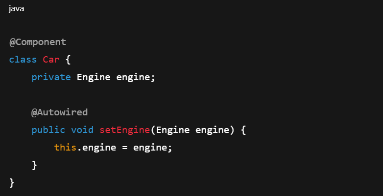
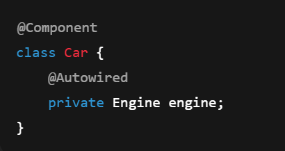

1. IOC (Inversion of Control)
   - IOC means the responsibility of object creation and dependency management is 
        transferred from application code to the Spring container.
   - creates objects
   - manages lifecycle
   - injects dependencies
   - destroys objects

2. DI (Dependency Injection)
    - IOC is the principle                 -> what (concept)
    - DI is the mechanism to implement IOC -> how (implementation)
    - Dependency Injection is a design pattern used by Spring to implement IOC by injecting required dependencies into a class.

3. @Component
    - @Component tells Spring to register this class as a bean during component scanning.

4.@ComponentScan
    - @ComponentScan tells Spring which packages to scan for stereotype annotations like @Component, @Service, @Repository, and @Controller.

5. why constructor Injection best
   - Constructor injection is preferred because it enforces mandatory dependencies,
     supports immutability, fails fast at startup, and exposes circular dependencies early.

6. Constructor Injection
   - Dependencies are provided through the constructor at the time of object creation 
   -  
   - Dependencies are mandatory            -> otherwise object wont create without all dependent dependencies
   - Object is created in valid state      -> An object is in a valid state when all required dependencies are available
                                              at the time of creation. Constructor injection enforces this by making
                                              dependencies mandatory, preventing null or partially initialized objects.

   - Supports immutability (final fields)  -> final allowed  ->state won't change ->safe in multi threaded env
   - Fails fast if dependency is missing   -> Application fails at startup -> Missing beans detected early
   - Exposes circular dependencies early  -> Circular dependencies cause startup failure
   - Easy to unit test                    -> Dependencies passed manually -> No Spring context needed

7.Setter Injection
   - Dependencies are provided using setter methods after object creation.
   -  
   - Dependency is not mandatory
   - Object can exist in incomplete state
   - Does not support immutability
   - Errors may occur at runtime
   - Circular dependencies may be hidden
       - When to use
         - Dependency is optional
         - Can be changed later

8. Field Injection (NOT Recommended)
   - Spring injects dependency directly into the field.
   -  
   - Hidden dependencies -> new Car(Engine engine) vs new Car()  -> Engine dependency not visible 
   - Cannot use final
   - Hard to unit test  --> need spring context (springbootTest) to add field dependencies 
                            or @Mock + @InjectMocks (which uses relection to add field injection after object creation)
   - Breaks immutability
   - Runtime failures possible

9. Fail Fast vs Fail Late (Important)
    - Fail Fast (Constructor Injection)
         - Error occurs at application startup
         - Safer and predictable
    - Fail Late (Setter / Field Injection)
         - Error occurs at runtime
         - Risk of production failures

10. What is Spring Container?
     - Spring Container is the core component of the Spring framework that is 
          responsible for creating, configuring, managing, and destroying Spring beans.
     - bean lifecycles

11. Types of Spring Containers
     - BeanFactory -> basic Spring container that provides core dependency injection features.
       - Lightweight
       - Uses lazy initialization (creates beans only when requested)
       - Minimal features
       - Mostly used in simple or memory-constrained environments
       - ApplicationContext
       
     - ApplicationContext -> Spring container built on top of BeanFactory.
       - Uses eager initialization (creates beans at startup)
       - Supports enterprise features
       - Most commonly used container
       - Used by Spring Boot internally

12. ## Spring Bean Lifecycle:
    * Instantiation
    * Dependency Injection
    * Initialization (@PostConstruct)
    * Ready for use
    * Destruction (@PreDestroy) --> prototype not fully managed during destruction

13. @preDestory for prototype beans
    - Prototype beans are created and initialized by Spring, but their
      destruction is not managed by the container. @PreDestroy is not
      called for prototype beans; cleanup must be handled by the client.
    - @PostConstruct is called during bean initialization.
      @PreDestroy is called only when the Spring ApplicationContext is closed.
      In plain Spring applications, context.close() must be called explicitly;
      otherwise, @PreDestroy will not execute.

