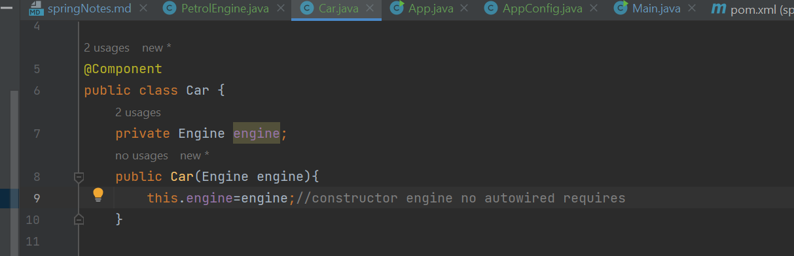
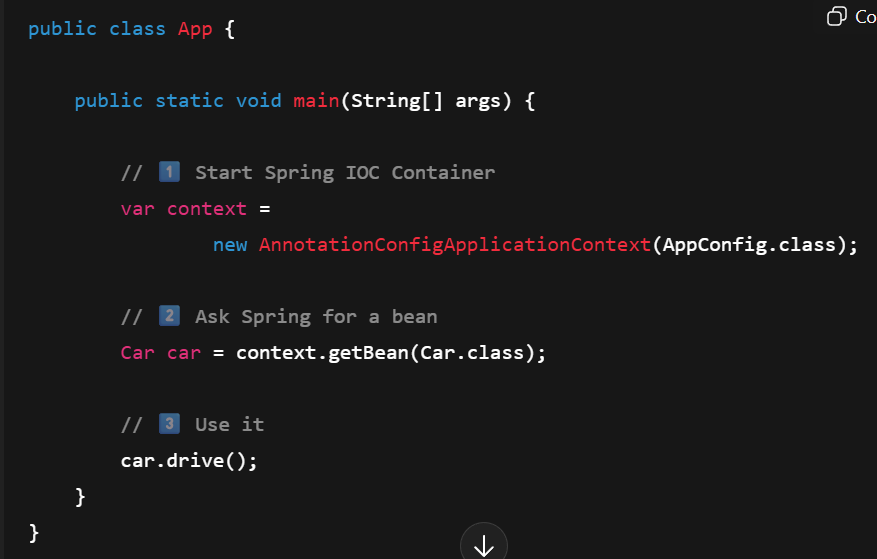
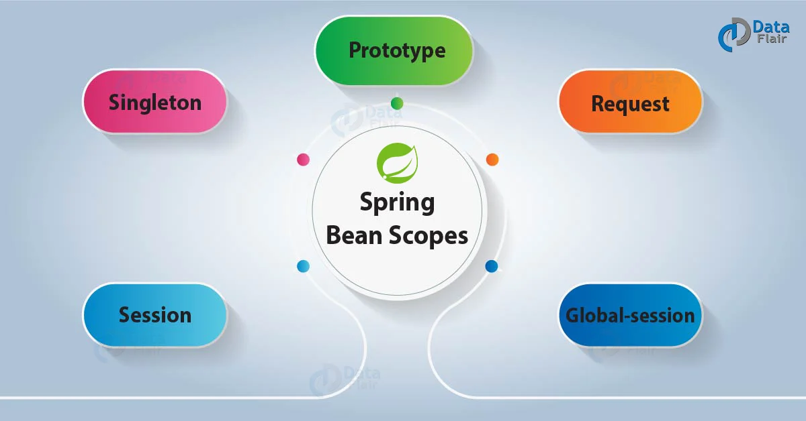
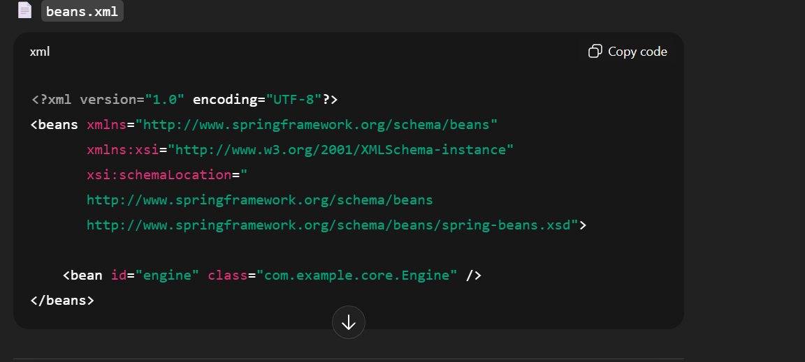
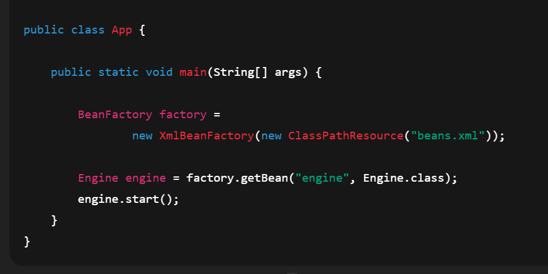
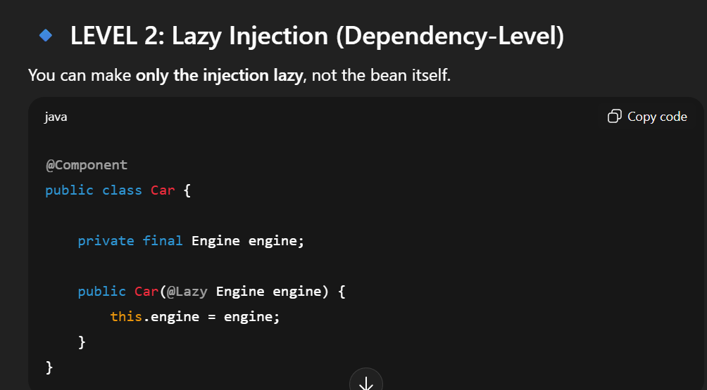
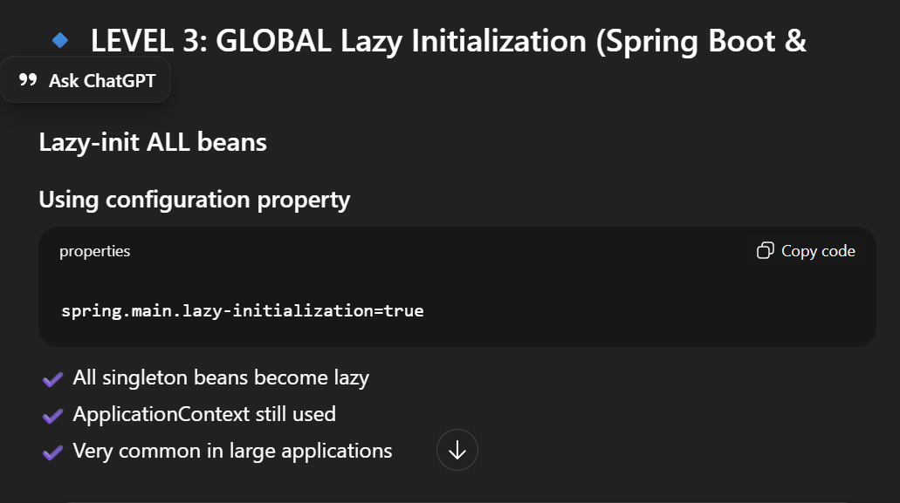

## This module demonstrates a plain Spring application using
## IOC, DI, component scanning, and Java-based configuration.

-create plain maven project
-add spring-context (need for IOC and DI)
- added Engine interface and PetrolEngine class
- add Car class
- 
- @Component:
     - Spring creates beans only for annotated classes
     - Spring will register this class as a bean in the IOC container”
- AppConfig -> acts as spring configuration 
      - @Configuration -> Without @ComponentScan, Spring container starts but finds zero beans
      - @ComponentScan("com.example.core") -> tell spring to check below modules to check for components
- App.java -> main file
   
  -  // 1️⃣ Start Spring IOC Container
     var context =
     new AnnotationConfigApplicationContext(AppConfig.class);
     // 2️⃣ Ask Spring for a bean
     Car car = context.getBean(Car.class);
     // 3️⃣ Use it
     car.drive();
- new AnnotationConfigApplicationContext(AppConfig.class);
  - Spring:
     - Creates ApplicationContext
     - Scans package
     - Creates beans
     - Resolves dependencies
     - Manages lifecycle
     - This is IOC in action.

## -BeanFactory vs applicationContext

BeanFactory: BeanFactory is a basic container mainly used to demonstrate lazy loading.

      * XmlBeanFactory loads beans.xml
      * Bean is NOT created immediately
      * Bean is created only when getBean() is called
      * This is lazy initialization

**Important Interview Notes**

* XmlBeanFactory is deprecated (Spring 3.1+)*
* Still asked for conceptual understanding 
* Replaced by ApplicationContext

### ApplicationContext:
- ApplicationContext is an advanced Spring container built on top of BeanFactory.
Key Characteristics

  * Uses eager initialization (creates beans at startup)
  * Supports enterprise features
  * Most commonly used container
  * Used by Spring Boot internally

ApplicationContext = eager initialization by default
It does not matter whether beans are defined via:
     * @Component
      * @Bean in @Configuration
      * XML

## **Can we have Lazy Initialization in ApplicationContext?**

What happens?
* Spring context starts
* engine bean is NOT created
* Bean is created only when first requested

Meaning
* Car is created at startup
* Engine is created only when first used
* 📌 This uses a proxy internally.

  

